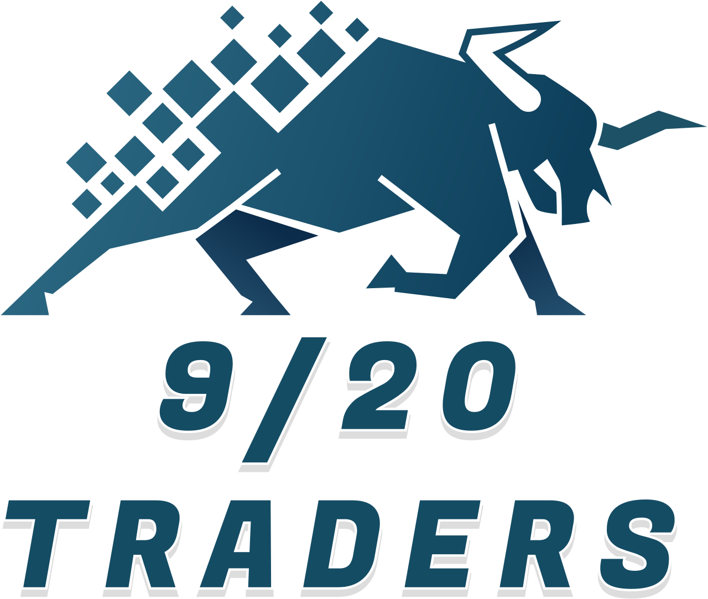

 

# Range Hunter - Trade Book

## Table of Contents
* [Strategy](#strategy)
  * [Trading Plan Summary](#trading-plan-summary)
  * [Detecting Ranges](#range-formation)
  * [Setups](#setups)
    * [Edge of Range](#edge-of-range)
    * [Fake Break and Recover](#fake-break-and-recover)
    * [Breakout](#breakout)
    * [Pullback](#pullback)
    * [Continuations](#continuation-type-a)
      * [Type A Pullback](#continuation-type-a)
      * [Type B Pullback](#continuation-type-b)
      * [Type C Pullback](#continuation-type-c)
      * [Type C Pullback with Strong Level](#continuation-type-c-with-level)
  * [Money and Risk Management](#money-and-risk-management)
  * [Trade Management](#trade-management)
  * [Trading Rules](#trading-rules)
  * [Trading Framework](#trading-framework)
* [Technology](#technology)
  * [Trading Tools](#trading-rules)
  * [Hot Keys / Buttons](#hot-keys--buttons)
  * [Journal Criteria](#journal-criteria)
* [Psychology](#psychology)
  * [Trader Personality Profile](#trader-personality-profile)
  * [Mental Trading Plan](#mental-trading-plan)
* [Trade Book Edge](#trade-book-edge)
  * [Edge Defined](#edge-defined)

# Strategy

## Trading Plan Summary
A day trading range breakout strategy, confirmed by a setup on a higher timeframe.

**Time:** Anytime of day

**Indicators:**
* A range on the 5-minute chart.
* A setup on the 60-minute chart.
* A setup on the daily chart that confirms the 60-minute setup.

**Setups:**
* [Edge of Range](#edge-of-range)
* [Fake Break and Recover](#fake-break-and-recover)
* [Breakout](#breakout)
* [Pullback](#pullback)
* [Continuations](#continuation-type-a)
  * [Type A Pullback](#continuation-type-a)
  * [Type B Pullback](#continuation-type-b)
  * [Type C Pullback](#continuation-type-c)
  * [Type C Pullback with Strong Level](#continuation-type-c-with-level)

**Entry Setups:**
* Enter when there is a breakout setup on the 5-minute chart:
  * [Edge of Range](#edge-of-range)
  * [Fake Break and Recover](#fake-break-and-recover)
  * [Breakout](#breakout)

**Entry Rules:**
* Wait for the candle to go from red to green (long) or green to red (short), to verify the entry is with the winning side.
* Enter on the first or second candle on all timeframes to avoid getting caught in a pullback.

**Exit Rules:**
* Exit when the setup is no longer valid.
* Exit when the trade target is reached.
* Exit immediately if the stop was placed in an incorrect location, or the setup analysis was incorrect.

**Profit Taking Rules:**
* Take a 25% partial when a pullback starts to form (new 5-minute high/low).

**Rules for Adding into a Position:**
* Add an additional 50% into a position when a 5-minute continuation setup is confirmed.
* Add an additional 100% into a position when a new breakout entry setup is confirmed.

**Notes:**

**Stock Selection:**

***
***

## Range Formation
A range is composed of a set of one or more 5-minute highs, and one or more 5-minute lows.

The formation of ranges can be predicted by watching for the formation of highs and lows.

**Advancing Stocks:**
When a stock is advancing, the first sign of a range formation is a new 5-minute low. When we get a new 5-minute low, we mark the previous high as the potential high of the range, and then we wait for a new 5-minute high.

[image 1]

After we have a new 5-minute high, we mark the previous low as the actual low of the range, and then we wait for a new 5-minute low.

[image 2]

Once we have a new 5-minute low, we mark the previous high as the actual high of the range, and we discard the potential high.

[image 3]

If the potential high is broken before making a new 5-minute low, then the potential high is the actual high of the range.

[image 4]

**Declining Stocks:**

When a stock is declining, the first sign of a range formation is a new 5-minute high. When we get a new 5-minute high, we mark the previous low as the potential low of the range, and then we wait for a new 5-minute low.

[image]

After we have a new 5-minute low, we mark the previous high as the actual high of the range, and then we wait for a new 5-minute high.

[image]

Once we have a new 5-minute high, we mark the previous low as the actual low of the range, and we discard the potential low.

[image]

If the potential low is is broken before making a new 5-minute high, than the potential low is the actual low of the range.

[image]

**Why we predict the range formation:**

Predicting the range before it has fully formed allows us to:
1. get a better risk vs reward, by improving our ability to predict the next candle, allowing us to get earlier entries. And,
1. gives us the opportunity to trade additional setups. For example, a pullback can be played when you detect the first 5-minute low in an advancing trend.

**Special Rules for Daily Ranges:**

When predicting a daily range there are extra rules that can be used to help improve the chances of a successful prediction.
1. When the stock crosses the 20-EMA, we start the formation of a new range, so we do not want to continue to predict candles in the direction of the trend. We should be looking for a reversal candle, where we can predict the next candle will make a new high/low and mark the start of the range.

[image 5]

2. When the price pulls back into the 50-SMA, expect the price to bounce and continue in the original direciton of the trend. If the price flags or sets up a range near the 50-SMA, play the break of the 50-SMA.

***
***

## Setups
* [Edge of Range](#edge-of-range)
* [Fake Break and Recover](#fake-break-and-recover)
* [Breakout](#breakout)
* [Pullback](#pullback)
* [Continuations](#continuation-type-a)
  * [Type A Pullback](#continuation-type-a)
  * [Type B Pullback](#continuation-type-b)
  * [Type C Pullback](#continuation-type-c)
  * [Type C Pullback with Strong Level](#continuation-type-c-with-level)

### Edge of Range
***

Reversal setting up near the edge of a range. The goal is to catch the beginning of the breakout move.

**Valid Timeframes:**

* 5-minute
* 15-minute
* 60-minute
* Daily
* Weekly

**Indicators:**

* A long bias on the daily chart.
* A range on the 5-minute chart that is wider than 2 times the height of an average 5-minute candle.
* A direct move from the top of the range into the bottom of the range.

**Confirmations:**

* A reversal candle or pattern near the bottom of the range on a smaller timeframe.
* The 5-minute candle at the bottom of the range closes bullish.
* (Bonus) A fake break below the bottom of the range.

**Entry Signal:**

* A new 5-minute low.

**Stop Loss:**

* Just below the bottom of the range, or
* The wick of the entry candle.

**Targets:**

* 30-50% of the range.

**Exit Signals:**

* The setup is no longer valid if a new 5-minute high is formed.

***
***

### Fake Break and Recover
***

Trend continuation setting up in the middle of a range. The goal is to anticipate the breakout from the range.

**Valid Timeframes:**

* 5-minute
* 15-minute
* 60-minute
* Daily
* Weekly

**Indicators:**

* A long bias on the daily chart.
* A range on the 5-minute chart.
* A breakdown from the range.

**Confirmations:**

* A break back into the range.
* A break of the middle of the range.

**Entry Signal:**

* Enter when the middle of the range is broken.
* Look for the entry candle to go from red to green before entering.

**Stop Loss:**

* Just below the bottom of the range, or
* The previous 5-minute low, if the range is wide and an ABCD pattern is formed after pulling back from the middle of the range on a smaller timeframe.

**Targets:**

* The high of the range.
* The next major daily or 60-minute level.
* Daily ATR target.

**Exit Signals:**

* The setup is no longer valid if the stock breaks the bottom of the range.
* If the stock breaks the range, then the setup is no longer valid if price pulls back to the middle of the range.

***
***

### Breakout
***

A breakout from the edge of a range. The goal is to enter the larger trend as early as possible.

**Valid Timeframes:**

* 5-minute
* 15-minute
* 60-minute
* Daily
* Weekly

**Indicators:**

* A long bias on the daily chart.
* A range on the 5-minute chart.

**Confirmations:**

* A bullish candle or pattern on the 1-minute chart closer to the top of the range.
* A daily or 60-minute level near the top of the range.
* (Bonus) A 15-minute or 60-minute range that we are also breaking out of.

**Entry Signal:**

* A break of the range.
* It’s ok to enter in anticipation of the range being broken if:
  * There is a clear entry using the smaller timeframe pattern, and
  * The potential breakout candle goes from red to green.
  * (Bonus) Increasing volume or speed on the tape.
* (Bonus) Increasing volume on the break of the level.

**Stop Loss:**

* The middle of the range, or
* The low of the smaller timeframe pattern.

**Targets:**

* The next major daily or 60-minute level.
* Daily ATR target.

**Exit Signals:**

* The setup is no longer valid if the price drops below the middle of the range, or
* A 5-minute range forms with a lower-high or lower-low, compared to the previously formed 5-minute range.

***
***

### Pullback
***

Reversal following a breakout and trend. The goal is to have an opportunity to enter a trade even if you miss the initial trend.

**Valid Timeframes:**

* 5-minute
* 15-minute
* 60-minute
* Daily
* Weekly

**Indicators:**

* A long bias on the daily chart.
* A range on the 5-minute chart.
* A breakout from the range.
* A parabolic trend following the breakout.
* At least a distance of two or more average sized 5-minute candles above the 9-EMA on the 5-minute chart.
* A daily or 60-minute level into which the stock is trending.

**Confirmations:**

* A range formation on the 1-minute chart around the level.
* (Bonus) Increase in overall volume as the price moves into the range.

**Entry Signal:**

* A break of the 1-minute range.
* (Bonus) Increasing volume as the range is broken.

**Stop Loss:**

* Just above the middle of the 1-minute range, or
* The wick of the entry candle.

**Targets:**

* VWAP on the 1-minute chart,
* The 9-EMA on the 5-minute chart,
* 50%-75% of the trend,
* The next major daily or 60-minute level.

**Exit Signals:**

* The setup is no longer valid if the price breaks the middle of the range.
* The setup is no longer valid if a new 5-minute higher-high or higher-low is formed.

***
***

### Continuation (Type A)
***

Reversal setting up near the edge of a range. The goal is to catch the beginning of the breakout move.

**Valid Timeframes:**

* 5-minute
* 15-minute
* 60-minute
* Daily
* Weekly

**Indicators:**
* A long bias on the daily chart.
* -

**Confirmations:**
* -

**Entry Signal:**
* -

**Stop Loss:**
* -

**Targets:**
* -

**Exit Signals:**
* -

***
***

### Continuation (Type B)
***

Reversal setting up near the edge of a range. The goal is to catch the beginning of the breakout move.

**Valid Timeframes:**

* 5-minute
* 15-minute
* 60-minute
* Daily
* Weekly

**Indicators:**
* A long bias on the daily chart.
* -

**Confirmations:**
* -

**Entry Signal:**
* -

**Stop Loss:**
* -

**Targets:**
* -

**Exit Signals:**
* -

***
***

### Continuation (Type C)
***

Reversal setting up near the edge of a range. The goal is to catch the beginning of the breakout move.

**Valid Timeframes:**

* 5-minute
* 15-minute
* 60-minute
* Daily
* Weekly

**Indicators:**
* A long bias on the daily chart.
* -

**Confirmations:**
* -

**Entry Signal:**
* -

**Stop Loss:**
* -

**Targets:**
* -

**Exit Signals:**
* -

***
***

### Continuation (Type C with Level)
***

Reversal setting up near the edge of a range. The goal is to catch the beginning of the breakout move.

**Valid Timeframes:**

* 5-minute
* 15-minute
* 60-minute
* Daily
* Weekly

**Indicators:**
* A long bias on the daily chart.
* -

**Confirmations:**
* -

**Entry Signal:**
* -

**Stop Loss:**
* -

**Targets:**
* -

**Exit Signals:**
* -

***
***

## Money and Risk Management

**Money & Risk Management Principle:**
I risk $100 per trade. I never lose more than $100 per trade and all my trades have a risk-vs-reward of 1:20.78. I take no more than 3 trades per day and never lose more than 3 trades per day ($300).

**Risk Management**

* **Risk Per Trade:** $100.00
* **Profit Target Per Trade:** $850.00
* **Max Loss Per Trade:** $100.00
* **Trade Limits:** No more than 3 trades per day.
* **Time Constraints:** Do not take a trade before 09:31 (ET) or after 9:35.59 (ET).
* **Stop Loss Mechanism:** Use a hard stop, via a market stop order in DAS Trader Pro.

**Money Management:**

* **Winning %:** 33.33%
* **Average Winner:** $850.00
* **Average Loser:** -$40.90
* **Average Trades Per Day:** 1.25 Trades
* **Discipline %:** 67.35%

**Scaling up Criteria:**
Once my discipline is at 80% for a minimum of 1 week and my equity curve has a positive slope for a minimum of 1 month, I can scale up my risk per trade by 20% to $120 / trade.

***
***

## Trade Management

**Removing Size from the Position Plan:**

* Take a 25% partial at the break of 4R.
* All out after the trade hits 10R.
* All out if the stock hits the stop loss.

**Adding to the Position Plan:**

* No adding to the position.

**Stop Loss Moving Plan:**

* Move stop loss to breakeven after the trade reaches 3.5R.
* Move stop loss to 8R after the trade reaches 9R.

**Seeking Realized Rate of Return:** 256%

***
***

## Trading Rules

**Rule 1:**
Day Trading is not easy. It is a serious business, and you should treat it as such.

**Rule 2:**
Always ask, "Is the stock moving because the overall market is moving or is it moving because it has a unique fundament catalyst."

**Rule 3:**
Success in day trading comes from risk management - finding low-risk entries with a high potential reward. The minimum win:lose ratio for me is 2:1.

**Rule 4:**
Your only job as a day trader is to manage risk. You cannot be a successful day trader without excellent risk management skills, even if you are the master of many effective strategies.

**Rule 5:**
Profitable trading does not involve emotion. If you are an emotional trader, you will lose your money.

**Rule 6:**
Trade within your TradeBook Edge Only: 1-Minute ORB with a strong daily bias.

**Rule 7:**
Stick to your entry rules to minimize loss…Rules are there to always protect capital.
* **Entry Rules:**
  * Indicators 2 of 3
  * Confirmations 5 of 5

**Rule 8:**
If a stock in play meets the indicators, confirmation, then enter a Stop Market order without any hesitation at the appropriate entry point.

**Rule 9:**
Stick to your exit rules to minimize loss…Rules are there to always protect capital.
* **Exit Rules:**
  * Press the Move Stop to BE hot key when the stock reaches 3.5R level.
  * Press the Partial 25% hotkey when the stock reaches 4R level.
  * Press the Move Stop to 8R hot key when the stock reaches 9R level.
  * Press the Close hotkey when the stock reaches 10R level.

**Rule 10**
If you look at your P/L you are done for the day as you are focusing on the money/outcome instead of the process of trading.

**Rule 11:**
I will not trade on days where I feel too rushed or cannot free my mind from other distractions. I need to be 100% focused on trading to trade effectively.

***
***

## Trading Framework

**Trading Tenets:**
* Commitment to executing the plan is more important than the outcome.
* I trust myself to make the correct decision in trading based on what the market is telling me.
* I graciously and enthusiastically accept the four perfect outcomes of a trade.
* Regardless of the environment, technical or fundamental analysis, the top priority will always be risk management.
* The number one thing to make me successful is leveraging my discipline.
* You need sufficient self-discipline to follow your trading plan, to avoid getting overexcited or depressed in the markets, and to resist the temptation to make emotional decisions.
* Being good at trading is the result of mastering the skills of trading and recognizing the fundamentals of a good trade.
* Trade by focusing on the process not the outcome.
* Successful traders are patient and resist the temptation to be involved in every move.
* Successful traders need to wait for opportunities where they feel comfortable and confident.
* Do not judge your trading strategy or yourself upon one trade because successful traders think in probabilities.
* Successful traders accept the loss, get out of the trade, and move on to the next trade.
* You need to constantly analyze the balance of power between buyers and sellers and bet on the winning group.

**Daily Stock Selection Criteria:**
* I have a set of stocks that I analyze daily to find stocks that have a clear directional bias.
* Stocks with news catalyst move up on my priority list.
* Stock’s RVOL must be above 100% during the opening period.
* Stocks that have a tight range on the 15, 30, or 60-minute chart move up on my priority list.
* Stocks must have significant volume (>150k) in the first minute of the market being open.

**Daily Max Loss:** $300.00

**Daily Profit Goal:** $1500.00

**Max 30 Day Loss:** $900.00

**Exchanges:** I prefer the NASDQ but will trade the NYSE.

**Additional:**
* My daily goal is to find good stocks to trade, to take the trades when they present themselves, and to execute the trades according to my plan.

***
***

# Technology

## Trading Tools

**Trading Platform:** DAS Trader Pro offers me the best execution speed which is essential to my order execution. I trade equities, so although this platform is basic in its layout, it offers me the correct level of information I need to make an informed decision with my strategy.

**Trading Scanners:** None

**Broker:** Interactive Brokers offers the best commission structure for my style of trading.

**Trading Desk:** I operate 2 computers, 1 laptop with no external screens, and one PC with 2 32-inch flat screen monitors.
* <ins>Left Monitor (PC)</ins>: This screen has thumbs of each of the stocks I am watching, so that I can quickly see which stocks are close to breaking the opening range.
* <ins>Right Monitor (PC)</ins>: This screen is my main trading screen. It has 1, 5, and 15-minute charts and a daily-chart for the stock I’m watching. It also has a 5-minute SPY chart, along with the time & sales and L2 for the stock I’m watching. This screen is setup to allow my eyes to process the desired information by focusing in a narrow area without having to constantly move my eyes.
* <ins>Laptop Screen</ins>: This screen has telegram and any video calling for courses or live trading sessions that I am using during my trading day.

**Trading Community:** Bear Bull Traders offers me a community in which I can learn and grow with like minded people. The community seeks to develop traders through educational material designed to develop a trader’s skill set.

***
***

## Hot Keys / Buttons

I choose to utilize the following hot buttons on the DAS montage.

* **ORB Short:** This calculates the stop loss and number of shares using a fixed risk per trade and creates a market order to enter the trade short. This improves execution speed and risk management.
* **ORB Long:** This calculates the stop loss and number of shares using a fixed risk per trade and creates a market order to enter the trade long. This improves execution speed and risk management.
* **Close:** This closes an open position by buying/selling all outstanding shares using a market order. It also removes any open stop orders.
* **Move Stop to BE:** This replaces the current stop order with a stop order at breakeven plus (long) or minus (short) $0.05.
* **Move Stop to 8R:** This replaces the current stop order with a stop order at 8R.
* **Partial 25%:** This closes 25% of the position and replaces the stop order to the remaining number of shares.
* **Draw Target Lines:** This draws lines at key levels (3.5R, 4R, 9R, and 10R) for the strategy. These lines make it easier to track trade progress without needing to look at P&L.
* **Draw End of Day Lines:** This draws lines at additional levels (-4R, -3R, -2R, -1R, 0R, 1R, 2R, 3R, 5R, 6R, 7R, and 8R) to help with end of day analysis.

***
***

## Journal Criteria

**Journal Tools:**
* **OneNote:** This is used for self-reflection and screenshots.
* **Excel:** This is used for goal tracking, statistical analysis for non-pulled data, and stock information.
* **TraderVue or TradeZella:** This is used for statistical analysis.

**Trade Analysis:**

***
***

# Psychology

## Trader Personality Profile

Complete the Trader Personality Profile: https://aware-profile.daytradingpsychology.com/ 

* **Agrarian Score:** 8
* **Warrior Score:** 4
* **Artist Score:** 5
* **Realist Score:** 5
* **Engineer Score:** 6

Based on your score, your Trader Type is the **Agrarian/Realist/Engineer Super-hybrid**.

***
***

## Mental Trading Plan

***
***

# Trade Book Edge

## Edge Defined

***
***
