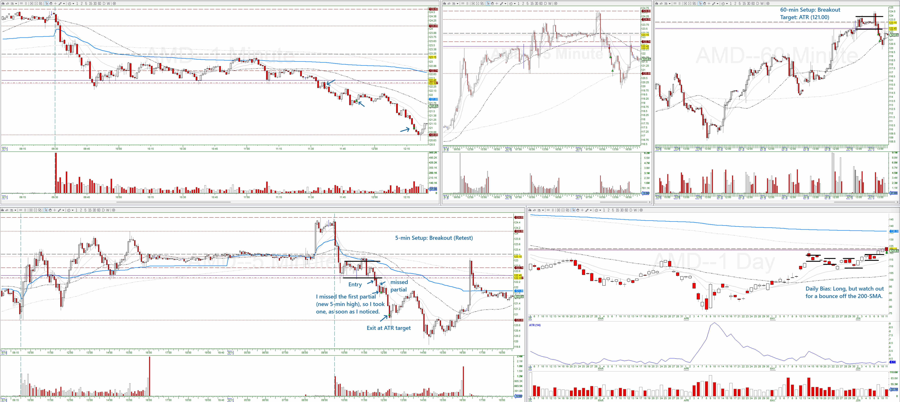

# AMD: June 6th, 2025
**Trade Category:** Green / Winner

**Trade Grade:** A

**Trade Direction:** Short

**60-minute Setup:**
Breakout

**5-minute Setup:**
Breakout

**Daily Setup:**
Trend (Day 3), but watch for a bounce off the 200-SMA

## Scoring Criteria:
### Setup:
- [X] + 43 points - 5-minute Setup
- [X] + 43 points - 60-minute Setup
- [X] + 6 points - 5-minute entry is a good entry for the 60-minute setup
- [X] + 2 points - Candle 1 or 2 on all timeframes
- [X] + 2 points - Not extended on any timeframe
- [ ] - 2 points - A minimum of 4:1 risk vs reward to target
- [X] + 1 point - Setup on 1-minute chart that would be a good entry for the 5-minute setup
- [X] + 1 point - Daily setup where the 5-minute entry is also a good entry for the daily setup
***
* **96 points (A)**

### Entry:
* 95-50 points - Entry location:
  - [ ] 95 points - Entry in correct location
  - [ ] 90 points - Slightly early entry, still ok
  - [ ] 90 points - Slightly late entry, still ok
  - [X] 90 points - Late entry (retest)
  - [ ] 90 points - Late entry (continuation)
  - [ ] 80 points - Early entry
  - [ ] 50 points - Late entry (extended)
* 5 - 0 points- Slippage:
  - [X] 5 points - No Slippage
  - [ ] 3 points - Minimal Slippage
  - [ ] 0 points - Significant Slippage
***
* **95 points (A)**

### Stop:
* 100-50 points - Stop location:
  - [ ] 100 points - Stop placed in correct safe location
  - [X] 95 points - Stop placed in correct agressive location
  - [ ] 95 points - Stop slightly wider than needed, but still ok
  * 90-80 points - Stop placed wider than needed
    - [ ] 90 points - Stop placement caused risk-to-reward to be up to 1R less than expected
    - [ ] 85 points - Stop placement caused risk-to-reward to be greater than 1R but less than or equal to 2R less than expected
    - [ ] 80 points - Stop placement caused risk-to-reward to be greater than 2R less than expected
  - [ ] 50 points - Stop placed too tight to entry
***
* **95 points (A)**

### Trade Management:
- [ ] 100 points - Exiting at correct location
  - [X] Exited at target
  - [ ] Exited at stop
  - [ ] Exited when trade was no longer valid
- [X] -5 points - (1) For each missed partial
- [X] -5 points - (2) For each missed add
- [ ] -10 points - Held past target
- [ ] -50 points - Exited early
***
* **85 points (B)**

### Additional Notes

## Images:

