# AVGO (Nov. 04 2025) - Trend Buddy

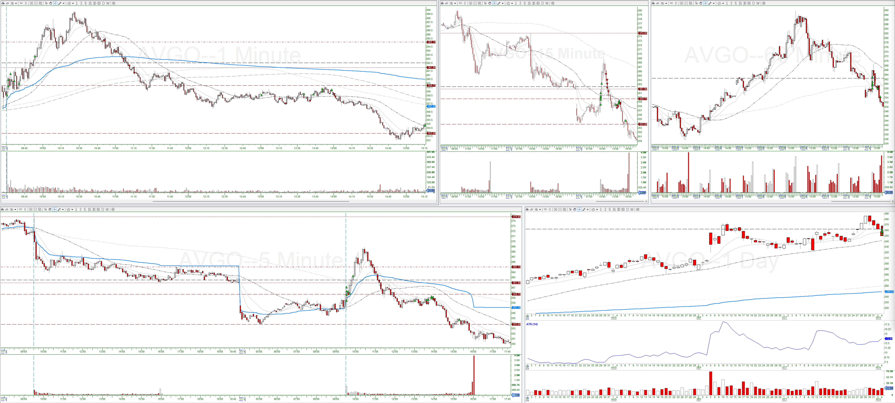

## Trade #1

5-min:

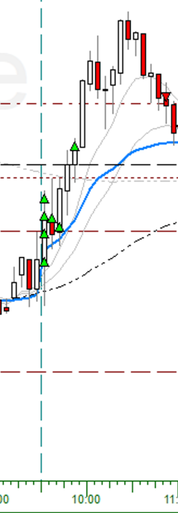

1-min:

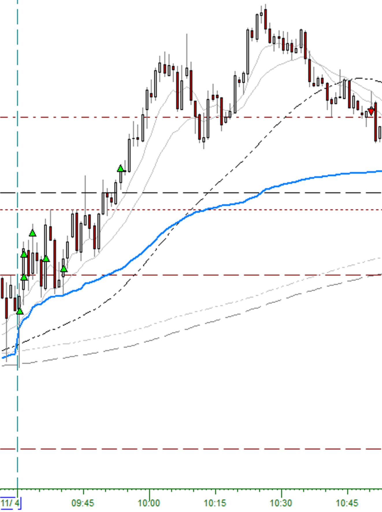

* Entry Criteria: 5-min Reversal Candle (Long 1)
* Confirmation Candle: 09:25:00, high: $359.75, low: $356.81
* Exit Reason: 5-min close below 9-EMA (10:50:00)
* Adds:
  * Add #1: Added at 1/3-R
  * Add #2: Added at 2/3-R
  * Add #3: Added at 1R
  * Add #4: Pullback Entry
  * Add #5: Pullback Entry
  * Add #6: Added at 2R

## Trade #2

5-min:

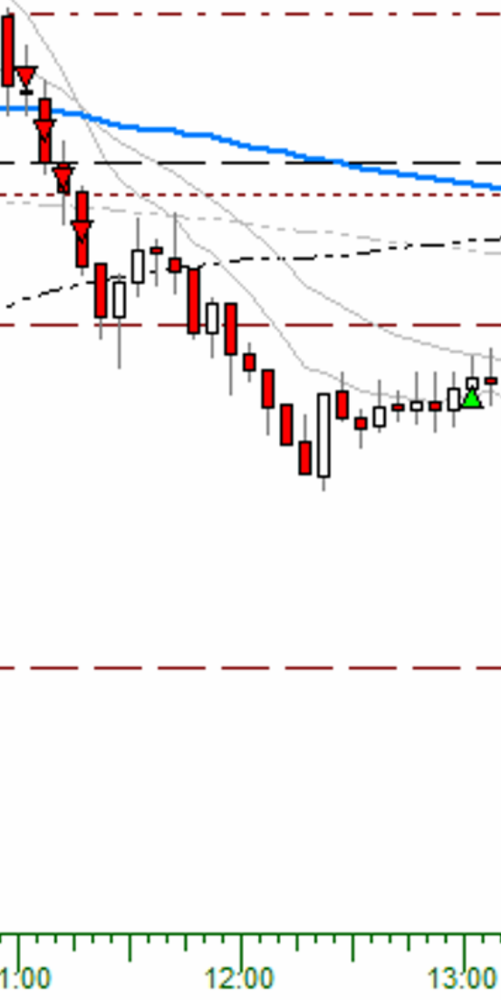

1-min:

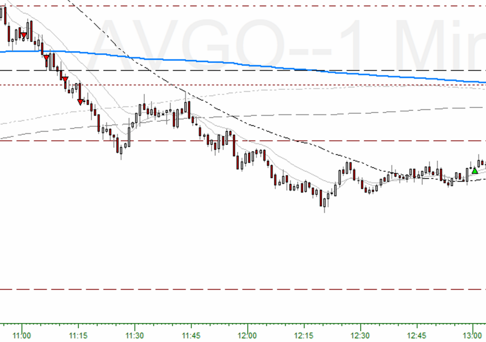

* Entry Criteria: Pullback (trend short)
* Confirmation Candle: 10:59:00, high: $364.25, low: $363.71
* Exit Reason: 5-min close above 9-EMA (13:00:00)
* Adds:
  * Add #1: Added at 1/3-R
  * Add #2: Added at 2/3-R
  * Add #3: Added at 1R
  * Add #4-6: Not enough buying power

## Trade #3

5-min:

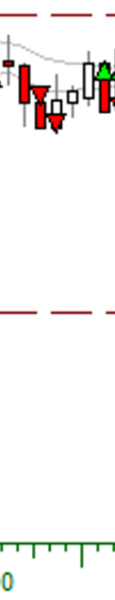

1-min:

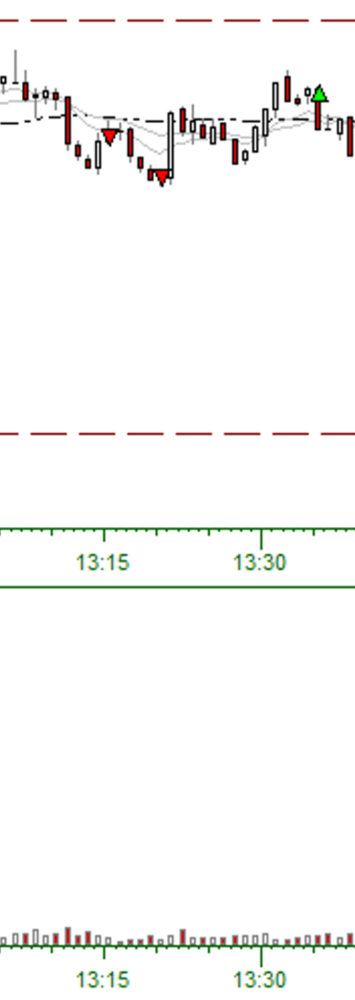

* Entry Criteria: 5-min Reversal Candle (Short 2)
* Confirmation Candle: 13:05:00-13:10:00, high: $359.37, low: $358.52
* Exit Reason: 5-min close above 9-EMA (13:35:00)
* Adds:
  * Add #1: Added at 1/3-R

## Trade #4

5-min:

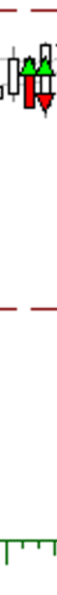

1-min:

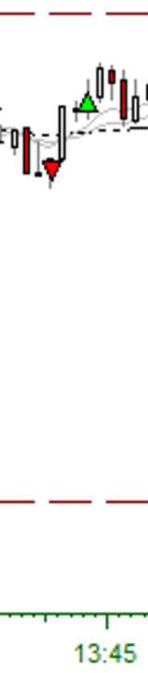

* Entry Criteria: Pullback (trend short)
* Confirmation Candle: 13:39:00, high: $364.25, low: $363.71
* Exit Reason: Stopped Out (13:43:00)
* Adds: None

## Trade #5

5-min:

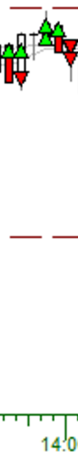

1-min:

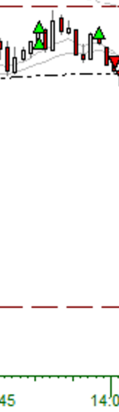

* Entry Criteria: 5-min Reversal Candle (Long 1)
* Confirmation Candle: 13:45:00, high: $359.15, low: $358.37
* Exit Reason: 5-min close above 9-EMA (14:00:00)
* Adds:
  * Add #1: Added at 1/3-R
  * Add #2: Continuation Entry

## Trade #6

5-min:

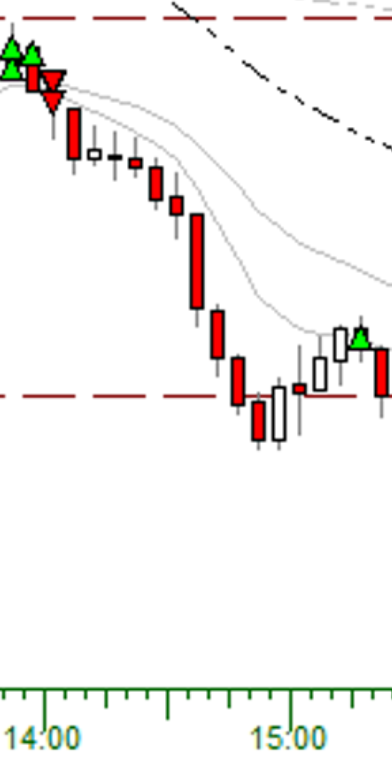

1-min:

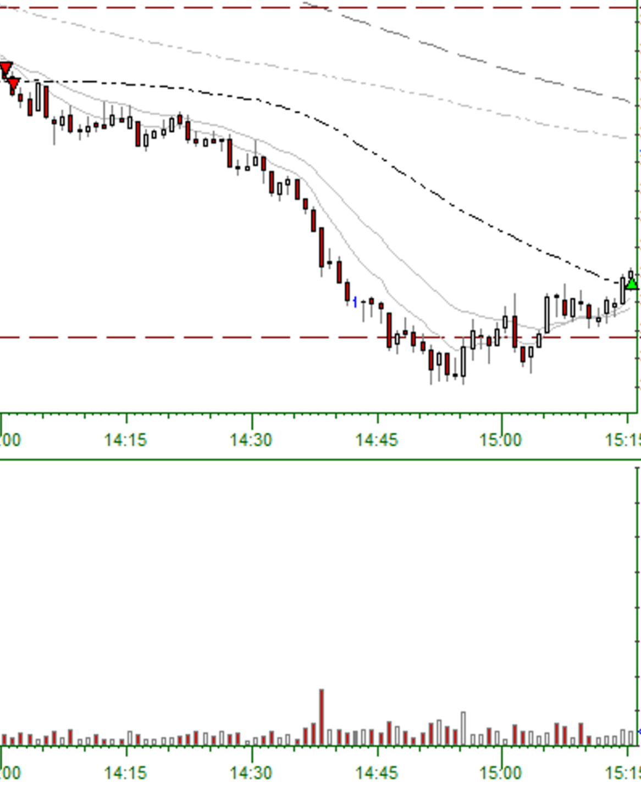

* Entry Criteria: 5-min Reversal Candle (Short 1)
* Confirmation Candle: 13:55:00, high: $359.35, low: $358.62
* Exit Reason: 5-min close above 9-EMA (15:15:00)
* Adds:
  * Add #1-6: Not enough buying power
