# GOOGL (Nov. 05 2025) - Trend Buddy

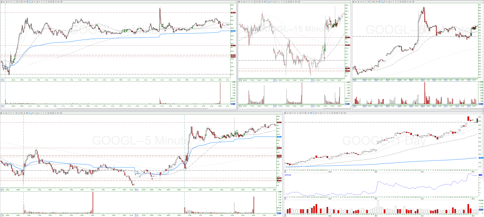

## Trade #1

5-min:

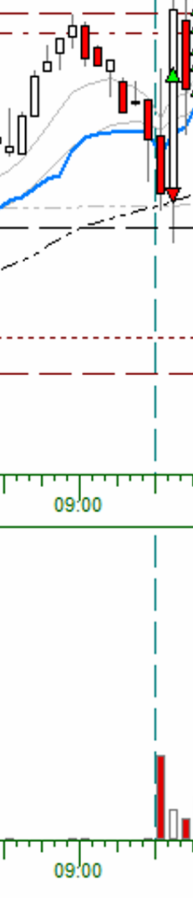

1-min:

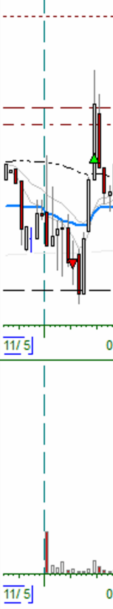

* Entry Criteria: Continuation (Short Trend)
* Confirmation Candle: 09:34:00, high: $278.59, low: $277.85
* Exit Reason: Stop Out (09:39:00)
* Adds: None

## Trade #2

5-min:

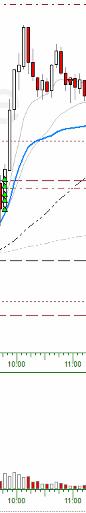

1-min:

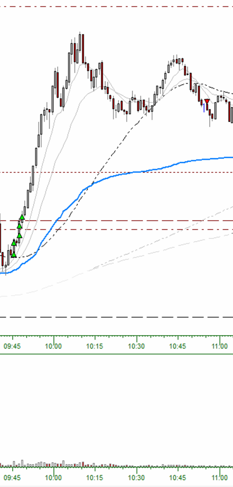

* Entry Criteria: 5-min Reversal Candle (Long 1)
* Confirmation Candle: 09:40:00, high: $280.22, low: $278.60
* Exit Reason: 5-min close above 9-EMA (10:55:00)
* Adds:
  * Add #1: Added at 1/3-R
  * Add #2: Added at 2/3-R
  * Add #3: Added at 1R
  * Add #4: Added at 4/3-R
  * Add #5-6: Not enough buying power

## Trade #3

5-min:

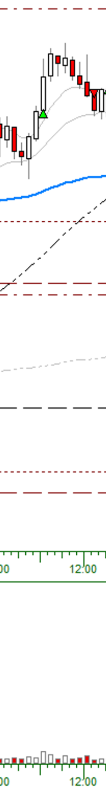

1-min:

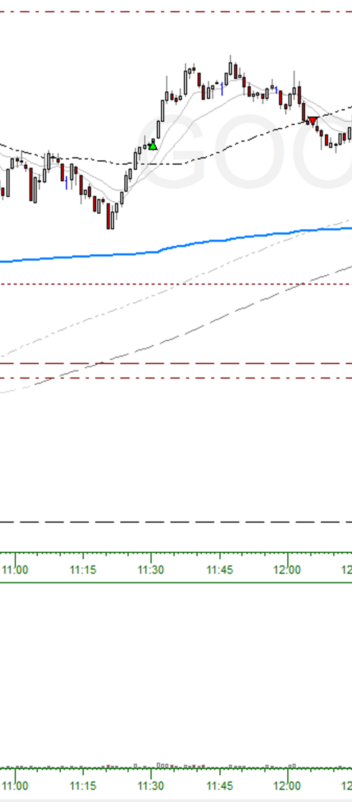

* Entry Criteria: 5-min Reversal Candle (Long 2)
* Confirmation Candle: 11:20:00-11:25:00, high: $283.6, low: $282.11
* Exit Reason: 5-min close above 9-EMA (12:05:00)
* Adds: None

## Trade #4

5-min:

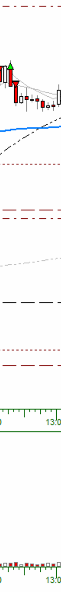

1-min:

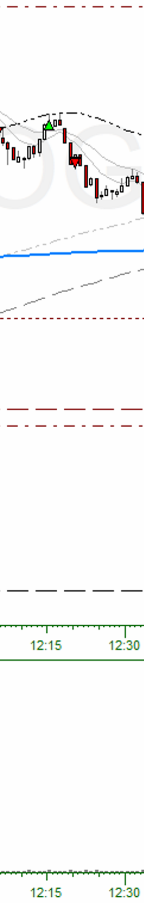

* Entry Criteria: 5-min Reversal (Long 1)
* Confirmation Candle: 12:10:00, high: $283.95, low: $283.3
* Exit Reason: Stopped Out (12:20:00)
* Adds: None

## Trades #5-13

5-min:

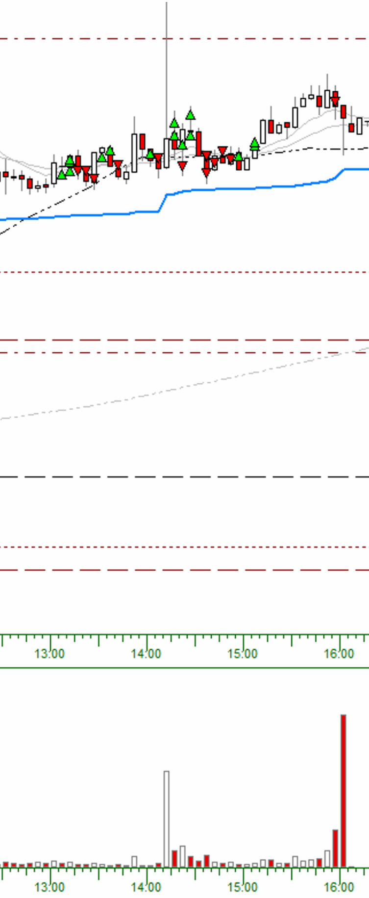

1-min:

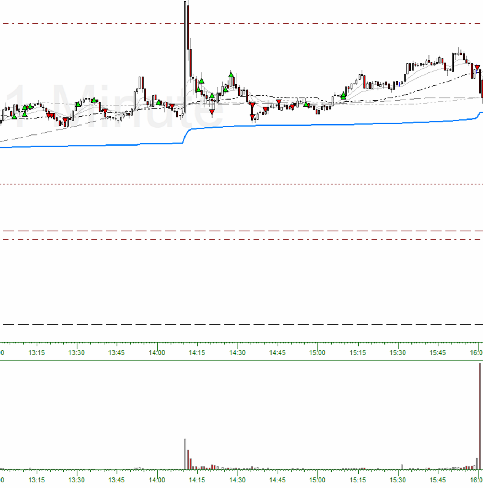

### Trade #5
* Entry Criteria: 5-min Reversal Candle (Short 1)
* Confirmation Candle: 12:15:00, high: $, low: $
* Exit Reason: 5-min close above 9-EMA (13:06:00)
* Adds:
  * Add #1-6: Not enough buying power

### Trade #6
* Entry Criteria: 5-min Reversal Candle (Long 1)
* Confirmation Candle: 13:08:00, high: $, low: $
* Exit Reason: Stopped Out (13:19:00)
* Adds:
  * Add #1: Added at 1/3-R
  * Add #2: Added at 2/3-R
  * Add #2: Added at 1R

### Trade #7
* Entry Criteria: 5-min Reversal Candle (Short 1)
* Confirmation Candle: 13:15:00, high: $, low: $
* Exit Reason: 5-min close above 9-EMA (13:30:00)
* Adds:
  * Add #1: Added at 1/3-R

### Trade #8
* Entry Criteria: 5-min Reversal Candle (Long 1)
* Confirmation Candle: 13:25:00, high: $, low: $
* Exit Reason: 5-min close above 9-EMA (13:40:00)
  * Add #1: Added at 1/3-R

### Trade #9
* Entry Criteria: 5-min Reversal Candle (Long 1)
* Confirmation Candle: 13:55:00, high: $, low: $
* Exit Reason: 5-min close above 9-EMA (14:05:00)
* Adds: None

### Trade #10
* Entry Criteria: 5-Min Reversal Candle (Long 1)
* Confirmation Candle: 14:10:00, high: $, low: $
* Exit Reason: Stopped Out (14:20:00)
* Adds:
  * Add #1: Added at 1/3-R
  * Add #2: Pullback Entry

### Trade #11
* Entry Criteria: 5-Min Reversal Candle (Long 1)
* Confirmation Candle: 14:20:00, high: $, low: $
* Exit Reason: 5-min close above 9-EMA (14:35:00)
* Adds:
  * Add #1: Added at 1/3-R

### Trade #12
* Entry Criteria: 5-Min Reversal Candle (Short 1)
* Confirmation Candle: 14:30:00, high: $, low: $
* Exit Reason: 5-min close above 9-EMA (14:55:00)
* Adds:
  * Add #1: Added at 1/3-R
  * Add #2: Pullback Entry
  * Add #3: Pullback Entry
  * Add #4: Continuation Entry

### Trade #13
* Entry Criteria: Pullback Entry (Long Trend)
* Confirmation Candle: 15:08:00, high: $, low: $
* Exit Reason: End of Day Auto Close (15:59:00)
* Adds:
  * Add #1: Added at 1/3-R
  * Add #2-6: Not enough buying power
