# GOOGL (Nov. 21 2025) - Trend Buddy

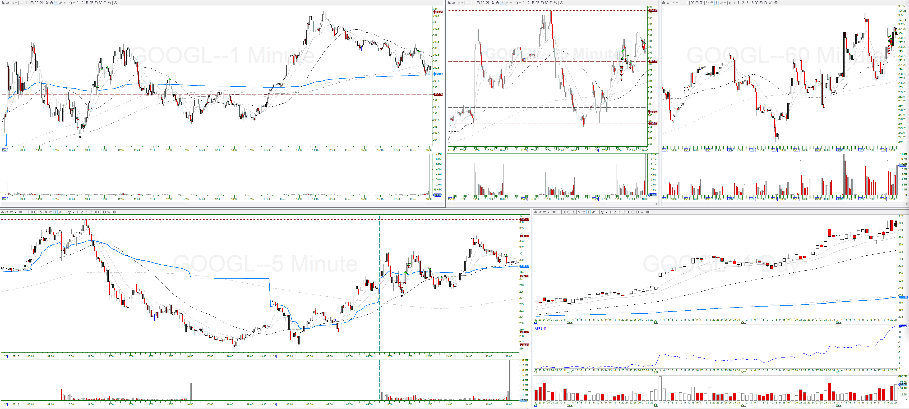

## Trade #1

5-min:

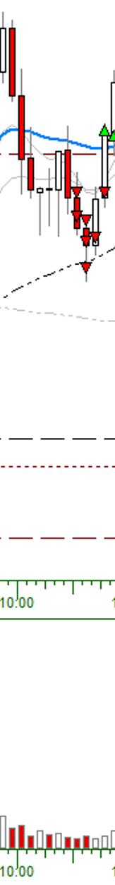

1-min:

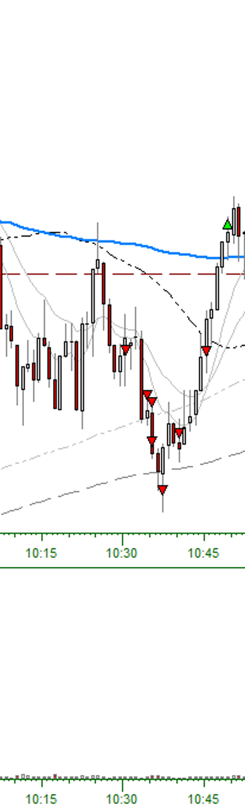

* Entry Criteria: 5-min Reversal Candle (Short 1)
* Confirmation Candle: 10:25:00, high: $, low: $
* Exit Reason: Stop Out (10:49:00)
* Adds:
  * Add #1: Added at 1/3-R
  * Add #2: Pullback Entry
  * Add #3: Added at 2/3-R
  * Add #4: Added at 1R
  * Add #5: Pullback Entry
  * Add #6: Pullback Entry

## Trade #2

5-min:

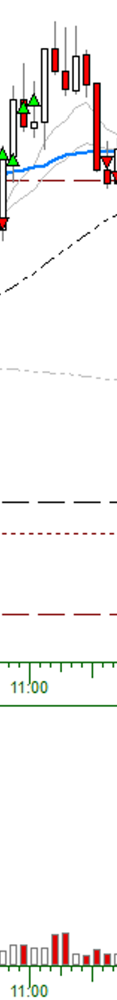

1-min:

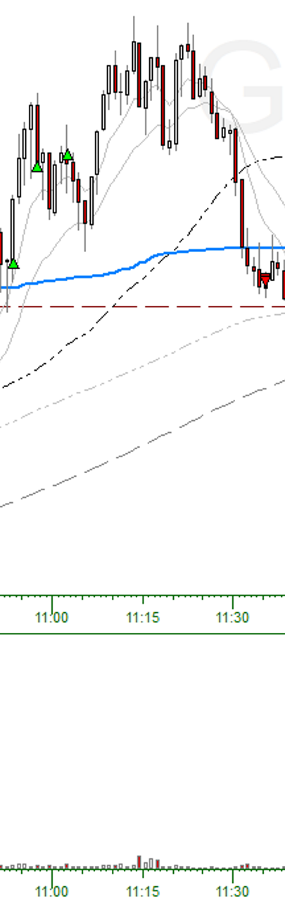

* Entry Criteria: Pullback (Long Trend)
* Confirmation Candle: 10:52:00, high: $, low: $
* Exit Reason: 5-min close above 9-EMA (11:35:00)
* Adds:
  * Add #1: Added at 1/3-R
  * Add #2: Continuation Entry

## Trade #3

5-min:

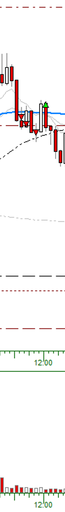

1-min:

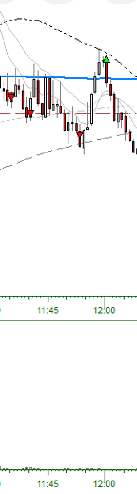

* Entry Criteria: 5-min Reversal Candle (Short 1)
* Confirmation Candle: 11:30:00, high: $, low: $
* Exit Reason: Stopped Out (12:00:00)
* Adds:
  * Add #1: Added at 1/3-R
  * Add #2: Added at 2/3-R

## Trade #4

5-min:

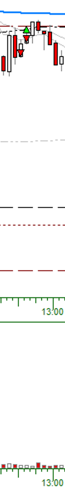

1-min:

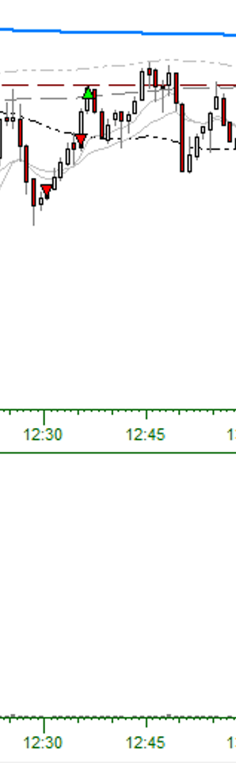

* Entry Criteria: 5-min Reversal (Short 1)
* Confirmation Candle: 12:25:00, high: $, low: $
* Exit Reason: Stopped Out (12:36:00)
* Adds:
  * Add #1: Pullback Entry

## Trade #5

5-min:

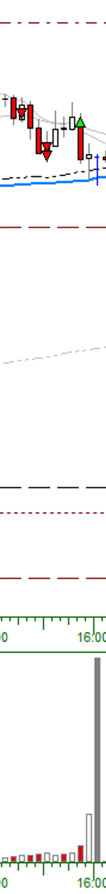

1-min:

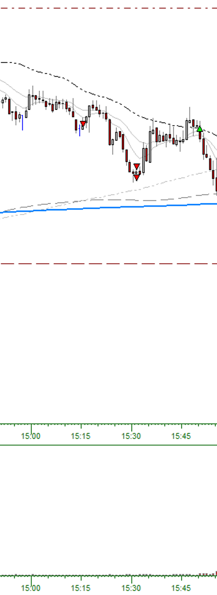

* Entry Criteria: 5-min Reversal Candle (Short 1)
* Confirmation Candle: 15:10:00, high: $, low: $
* Exit Reason: 5-min close above 9-EMA (15:50:00)
* Adds:
  * Add #1-3: Not enough buying power
  * Add #4: 4/3-R
  * Add #5: 5/3-R
