# MU (Nov. 06 2025) - Trend Buddy

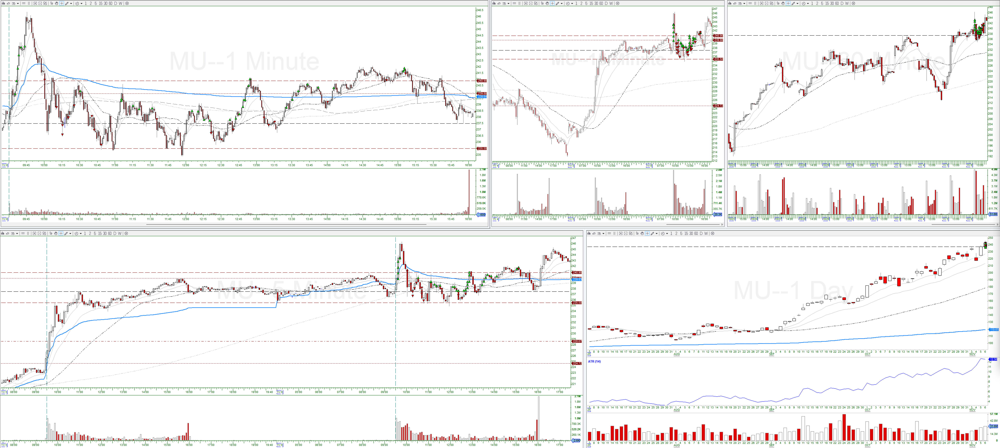

## Trade #1

5-min:

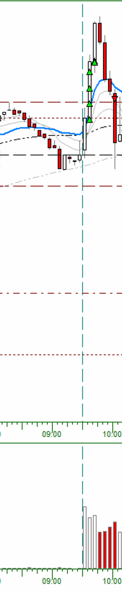

1-min:

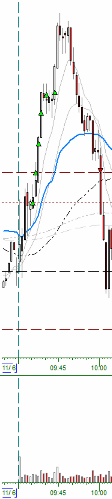

* Entry Criteria: Pullback (Long Trend)
* Confirmation Candle: 09:34:00, high: $, low: $
* Exit Reason: 5-min close below 9-EMA (10:00:00)
* Adds:
  * Add #1: Added at 1/3-R
  * Add #2: Added at 2/3-R
  * Add #3: Added at 1R
  * Add #4: Added at 4/3-R
  * Add #5: Pullback Entry
  * Add #6: Not enough buying power

## Trade #2

5-min:

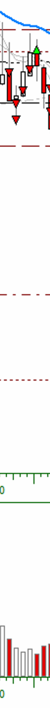

1-min:

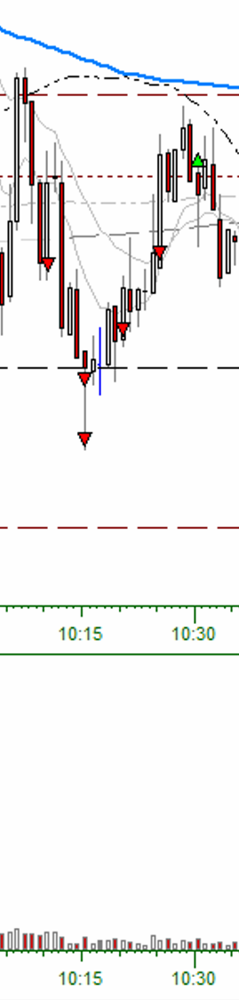

* Entry Criteria: 5-min Reversal Candle (Short 1)
* Confirmation Candle: 10:05:00, high: $, low: $
* Exit Reason: 5-min close above 9-EMA (10:30:00)
* Adds:
  * Add #1: Added at 1/3-R
  * Add #2: Added at 2/3-R
  * Add #3: Pullback Entry
  * Add #4: Pullback Entry

## Trade #3

5-min:

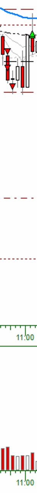

1-min:

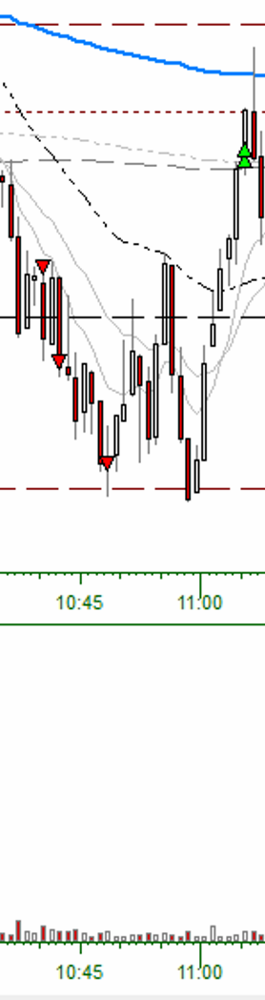

* Entry Criteria: 5-min Reversal Candle (Short 2)
* Confirmation Candle: 10:30:00-10:35:00, high: $, low: $
* Exit Reason: 5-min close above 9-EMA (11:05:00)
* Adds:
  * Add #1: Added at 1/3-R
  * Add #2: Added at 2/3-R

## Trade #4

5-min:

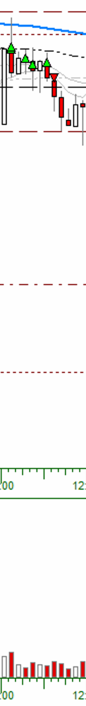

1-min:

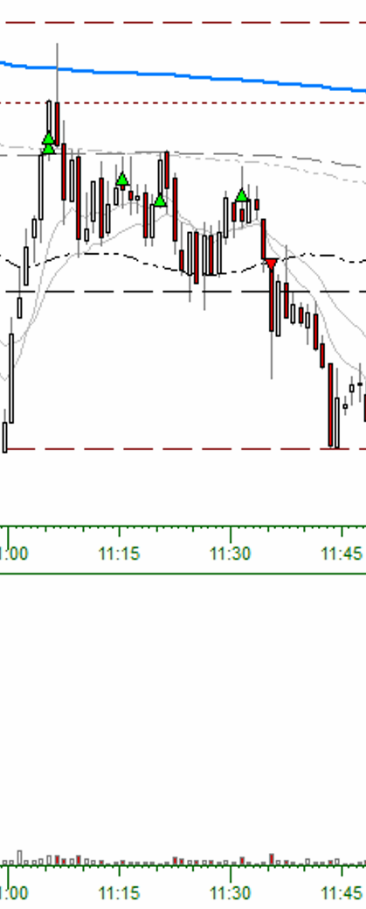

* Entry Criteria: 5-min Reversal (Long 1)
* Confirmation Candle: 11:00:00, high: $, low: $
* Exit Reason: 5-min close below 9-EMA (11:35:00)
* Adds:
  * Add #1: Continuation Entry
  * Add #2: Pullback Entry
  * Add #3: Continuation Entry

## Trade #5

5-min:

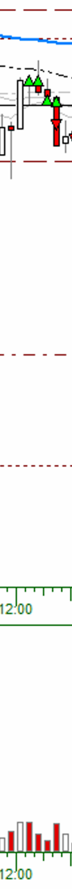

1-min:

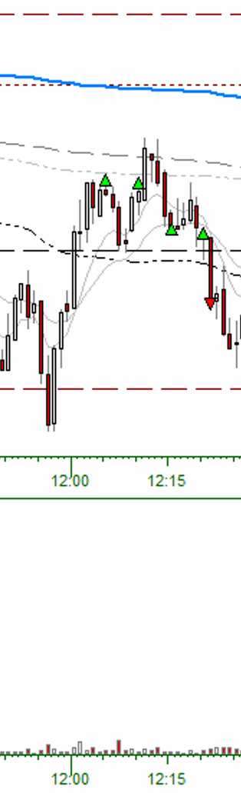

* Entry Criteria: 5-min Reversal Candle (Long 1)
* Confirmation Candle: 12:00:00, high: $, low: $
* Exit Reason: Stopped Out (12:21:00)
* Adds:
  * Add #1: Continuation Entry
  * Add #2: Pullback Entry
  * Add #3: Pullback Entry

## Trade #6

5-min:

1-min:

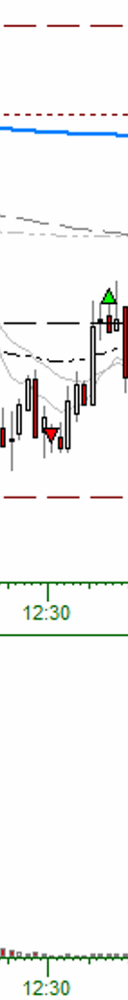

* Entry Criteria: Pullback (Short Trend)
* Confirmation Candle: 12:28:00, high: $, low: $
* Exit Reason: Stopped Out (12:37:00)
* Adds: None

## Trade #7

5-min:

1-min:

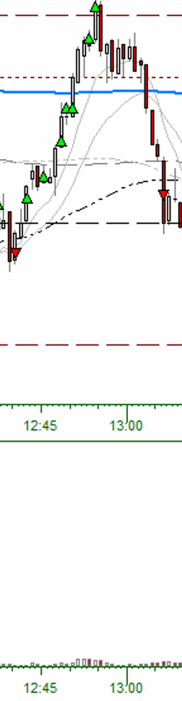

* Entry Criteria: Continuation (Long Trend)
* Confirmation Candle: 12:39:00, high: $, low: $
* Exit Reason: Stopped Out (12:42:00)
* Adds: None

## Trade #8

5-min:

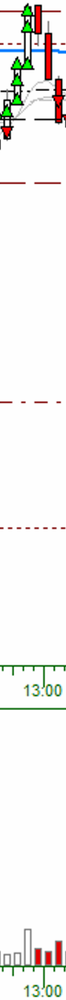

1-min:

* Entry Criteria: 5-min Reversal Candle (Long 1)
* Confirmation Candle: 12:40:00, high: $, low: $
* Exit Reason: 5-min close below 9-EMA (13:06:00)
  * Add #1: Added at 1/3-R
  * Add #2: Added at 2/3-R
  * Add #3: Pullback Entry
  * Add #4: Added at 1R
  * Add #5: Added at 4/3-R

## Trade #9

5-min:

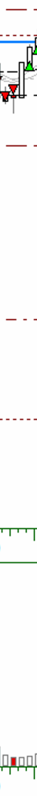

1-min:

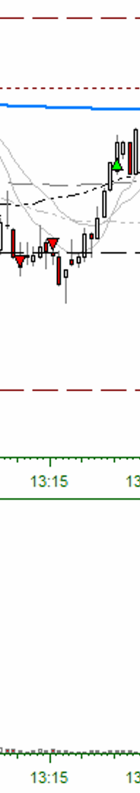

* Entry Criteria: 5-min Reversal Candle (Short 1)
* Confirmation Candle: 13:05:00, high: $, low: $
* Exit Reason: 5-min close above 9-EMA (13:25:00)
* Adds: None

## Trade #10

5-min:

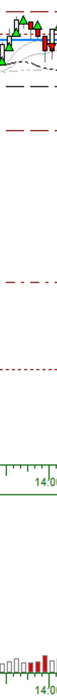

1-min:

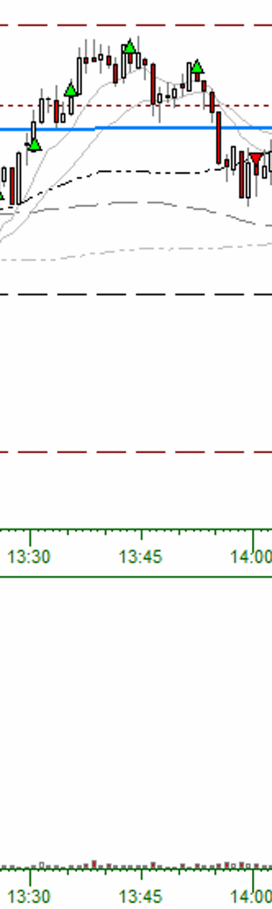

* Entry Criteria: 5-Min Reversal Candle (Long 1)
* Confirmation Candle: 13:25:00, high: $, low: $
* Exit Reason: 5-min close below 9-EMA (14:00:00)
* Adds:
  * Add #1: Added at 1/3-R
  * Add #2: Added at 2/3-R
  * Add #3: Continuation Entry

## Trade #11

5-min:

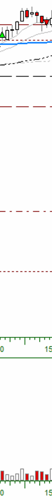

1-min:

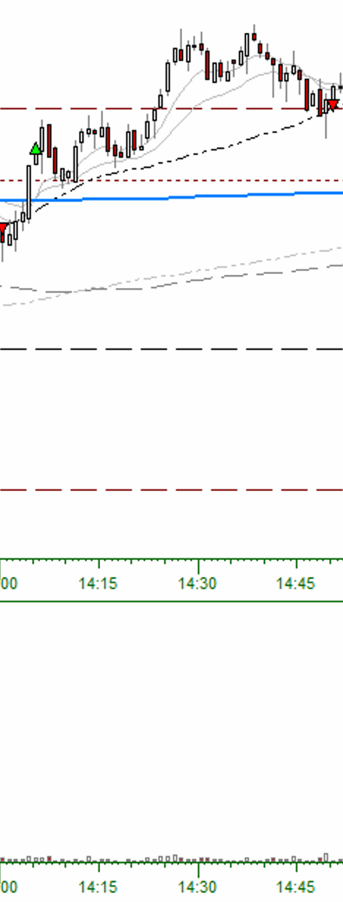

* Entry Criteria: 5-Min Reversal Candle (Long 1)
* Confirmation Candle: 14:00:00, high: $, low: $
* Exit Reason: 5-min close below 9-EMA (14:50:00)
* Adds: None

## Trade #12

5-min:

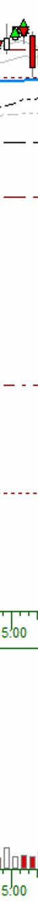

1-min:

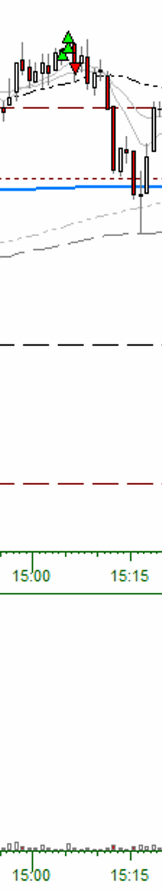

* Entry Criteria: Continuation (Long Trend)
* Confirmation Candle: 15:03:00, high: $, low: $
* Exit Reason: Stopped Out (15:06:00)
* Adds:
  * Add #1: Added at 1/3-R
  * Add #2: Added at 2/3-R
