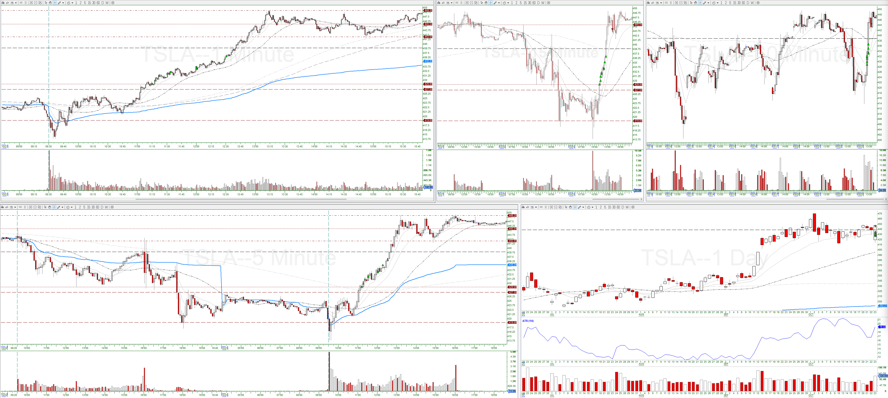
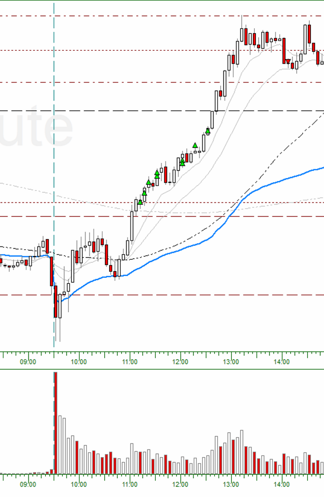
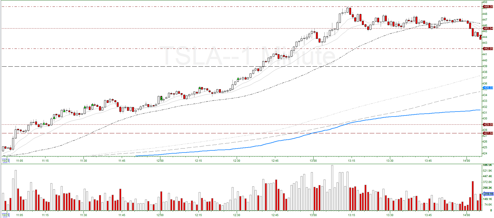

# TSLA (Oct. 23 2025) - Trend Buddy

## Trade #1

5-min:

1-min:

* Entry Criteria: Pullback (Long Trend)
* Confirmation Candle: 11:13:00, high: $429.25, low: $428.28
* Exit Reason: 5-min close below 9-EMA (14:05:00)
* Adds:
  * Add #1: Added at 1R
  * Add #2: Added at 2R
  * Add #3: Added at 3R
  * Add #4: Added at 4R
  * Add #5: Added at 5R
  * Add #6: Not enough buying power

## Trade #2

5-min:

1-min:

* Entry Criteria: Continuation (Long Trend)
* Confirmation Candle: 11:59:00, high: $433.97, low: $432.45
* Exit Reason: 5-min close below 9-EMA (14:05:00)
* Adds:
  * Add #1: Added at 1R
  * Add #2: Added at 2R
  * Add #3-6: Not enough buying power
