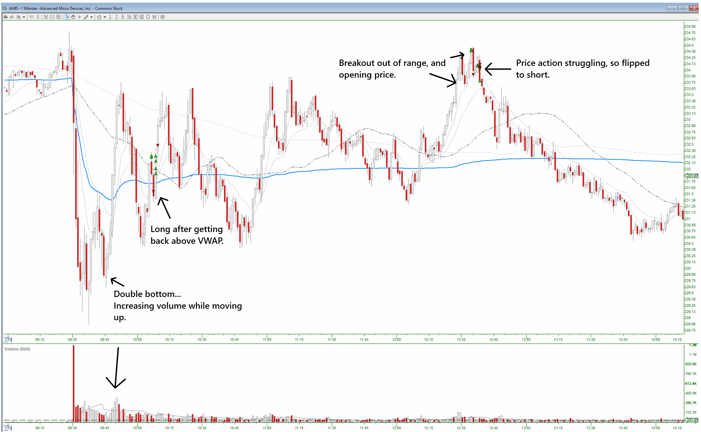
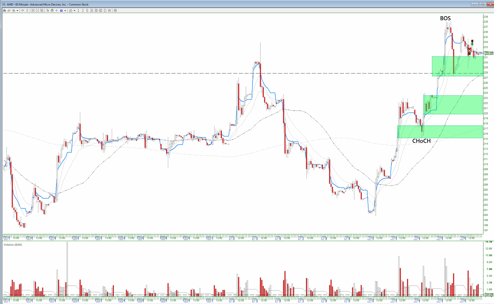
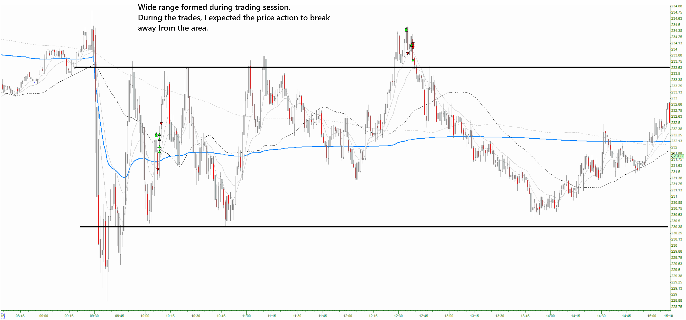

# AMD (Jan. 16, 2026)

## Trades
1. Long (2 entries), closed early for a loss.
2. Long (4 entries), closed for a gain.
3. Long (2 entries), closed early for a loss.
4. Long (2 entries), closed early for no gain.
5. Short (4 entries), closed early for a gain.

## Strucutre After the Fact:
**60-min:**

**1-min:**
* I didn't see the range forming on the first set of longs (in the middle of the range).
* Then I started to see the breakout from the range and tried to play the breakout.
* After the breakout failed (or looked like it was going to fail), I flipped to short.

