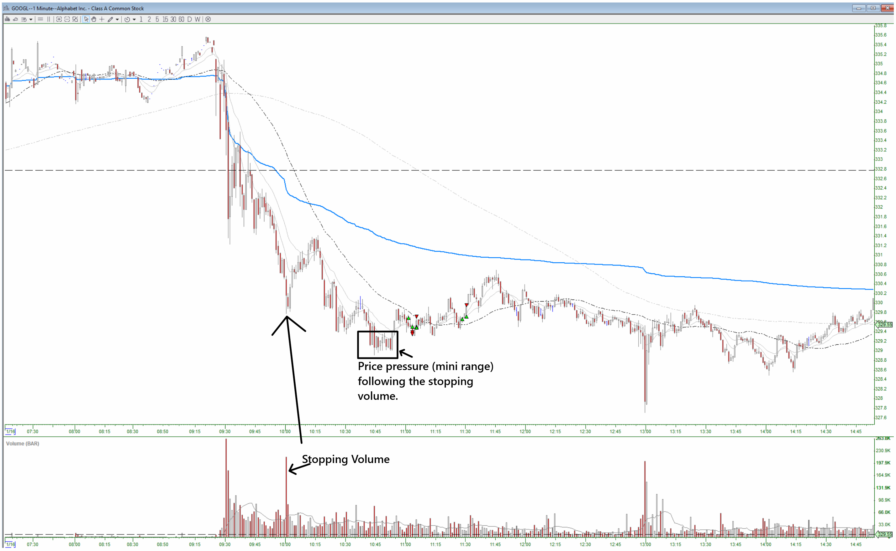
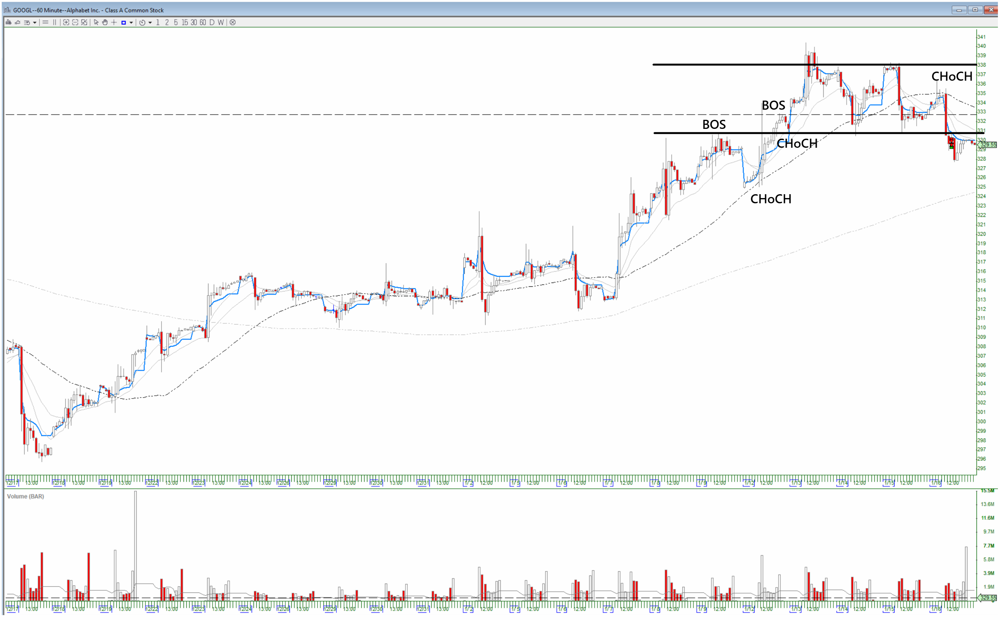

# GOOGL (Jan. 16, 2026)

## Trades
1. Long (1 entry), stopped out.
2. Long (1 entry), stopped out.
3. Long (2 entries), closed early for a gain.
4. Long (4 entries), closed early for a gain.

## Strucutre After the Fact:
**60-min:**

