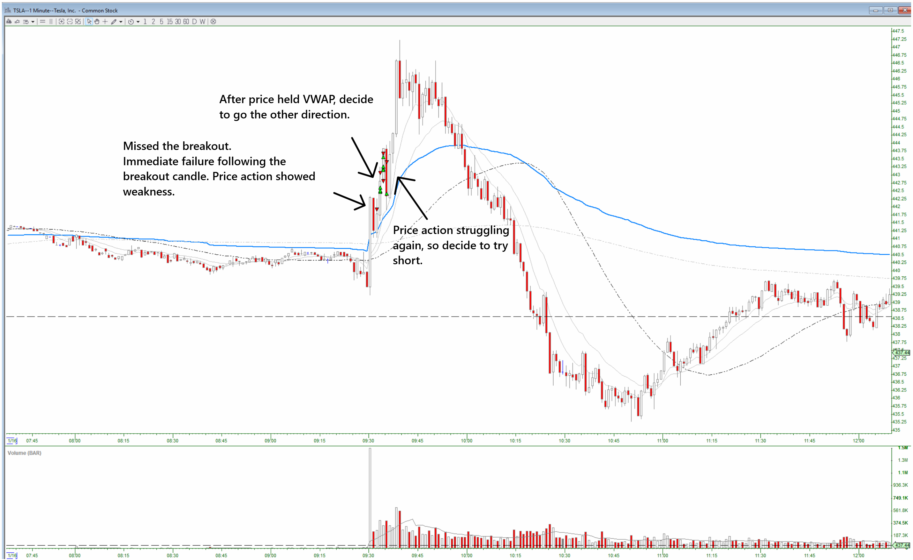
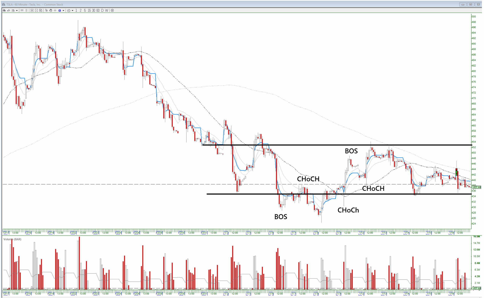

# TSLA (Jan. 16, 2026)

## Trades
1. Short (1 entry), stopped out.
2. Long (3 entries), closed early for a gain.
3. Short (1 entry), stopped out.
4. Long (3 entries), closed early for a gain.
5. Short (1 entry), closed early for a gain.

## Strucutre After the Fact:
**60-min:**

